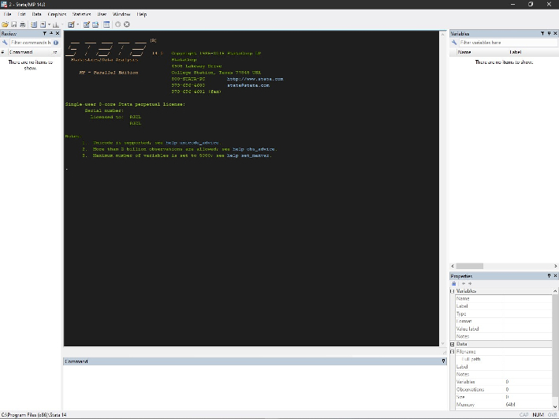

Ayudantia 1 - Introduccion a Stata
==================================

Pia Carozzi

PUC

*pjcarozzi\@uc.cl*

1 - Iniciar una sesion en Stata
==============================

Al abrir Stata, podemos reconocer cuatro ventanas basicas:

1.  Resultados
2.  Command
3.  Review
4.  Variables y Propiedades

Stata es un programa que opera a traves de comandos. Los comandos pueden ser escritos en la ventana *Command* o ejecutados desde un *do-file*.

Cuando se ejecuta un comando, los resultados aparecen en la ventana *Results*.

La ventana *Review* constituye un historial de comandos, listando todos los comandos que han sido ejecutados durante la sesion en Stata.

Las ventanas *Variables* y *Properties* exponen la lista de variables presentes en la base de datos cargada en la memoria del programa y sus propiedades. Cuando no hay una base de datos cargada, estas ventanas no muestran informacion.

Para mantener un registro de todas las operaciones realizadas sobre los datos, utilizaremos un *do-file*. Abrimos el *Do-file Editor*, escribiendo

          . doedit

en la ventana *Command* y presionando *Enter*.

Con esto se abre el *do-file editor*, por ahora una ventana en blanco que muestra la pestaña *untitled.do* que identifica el archivo que acabamos de crear.

El *do-file editor* permite editar los scripts o archivos de ordenes de Stata, llamados *do-files*.

Usar el do-file para guardar los comandos utilizados constituye una buena practica y sera promovida en este curso. Los *do-file* nos permitiran registrar ordenadamente el codigo utilizado y con esto el procesamiento realizado sobre los datos. A su vez, este registro posibilita que otros puedan usar el codigo y volver a realizar nuestros analisis de los datos, es decir, que este sea potencialmente reproducible.

Con ambos objetivos en mente (orden y "reproducibilidad"), se recomienda organizar el codigo en secciones y realizar aclaraciones respecto a los que se pretende hacer y cuales son los resultados esperados. El lenguaje de Stata reconoce marcadores especificos como comentarios, es decir, como trozos de texto que no son codigo y por lo tanto no debe ser ejecutado. Insertar estos comentarios nos permite no solo mantener un
registro ordenado y reproducible, sino "humanamente" comprensible.

Stata tiene diversas maneras de identificar comentarios:

1.  Iniciar una linea con \*
2.  Ingresar // en una linea
3.  Varias lineas con /\*\*\* y \*\*\*/

Todo lo que ha sido identificado como comentario y reconocido por Stata quedara registrado en el *do-file* en color verde.

Convencionalmente, las primeras lineas de un *do-file* incluyen un encabezado que identifica el proyecto, nombre de archivo, la version del programa, fecha, autor y otros datos que se consideren relevantes. Por ejemplo, ingresamos la siguiente informacion en el *do-file* recien creado. Como no se trata de comandos, la identificamos como comentario.

Otra convencion es que la primera linea de comando identifique la version de Stata para la cual se escribio el *do-file*. Esto permite que versiones mas recientes del programa reconozcan los comandos.

Si no sabemos con certeza que version estamos usando usemos el comando:

          . version
          version 14.0

Volvamos al *do-file*, y escribimos

          . version 14

Tambien es recomendable limpiar la memoria del programa, para empezar la sesion desde cero.

          . clear all

          . macro drop _all

          . capture log close

Para mantener los archivos localmente ordenados, declaramos una carpeta de trabajo. Stata buscara y guardara los archivos producidos durante la sesion en esta carpeta a menos que se especifique una diferente. Como ejemplo, creemos una carpeta en Desktop:

          . mkdir "C:\Users\pjcar\Desktop\ayudantia1"

Para declarar que esta carpeta sera nuestra carpeta de trabajo, escribimos:

          . cd "C:\Users\pjcar\Desktop\ayudantia1"
          C:\Users\pjcar\Desktop\ayudantia1

La direccion debe ir entre comillas y debe referir a una carpeta existente.

Ejecutemos lo que hemos escrito en nuestro *do-file*. Seleccionamos los comandos que deseamos ejecutar y presionamos CTRL+D (Command+Shift+D en Mac)

Con esto quedan declarada nuestra carpeta y los comandos iniciales. Verifiquemos los contenidos del directorio de trabajo.

          . dir
            <dir>   3/20/19 23:22  .                 
            <dir>   3/20/19 23:22  ..                

          . do "C:\Users\pjcar\AppData\Local\Temp\STD01000000.tmp"

La carpeta esta vacia. Guardemos en ella el *do-file* en el que estamos trabajando. Esto debe hacerse a traves de GUI. En la ventana del *Do-file Editor*, el menu desplegable *File* contiene la opcion *Save as*.

Llamemos este archivo "ayudantia1" y cerremos el *do-file*. Volvamos a checkear los contenidos de la carpeta.

          . dir
            <dir>   3/20/19 23:22  .                 
            <dir>   3/20/19 23:22  ..                
             1.3k   3/20/19 21:19  ayudantia1.do     

OK. Volvamos a abrir *ayudantia1.do*, esta vez a traves de la ventana *Command*.

          . doedit ayudantia1

Los *do-file* sirven para guardar los comandos, pero no los resultados que van apareciendo en la ventana *Results*. Para registrar todo el proceso, podemos usar un *log file*. Los *log files* son especialemente practicos cuando se ejecutan secciones largas de codigo, porque la ventana *Results* solo muestra los resultados mas recientes, o, por ejemplo, cuando el procesamiento es muy demandante en recursos y no queremos/podemos volver a correr el codigo, o cuando, por motivos externos (ej. Windows se cuelga/reinicia) el programa se cierra. Los *log files* no son necesarios, pero son utiles.

Creemos un log file llamado *logayudantia1*, que tendra por nombre *ayudantia*:

          . log using logayudantia1, replace name(ayudantia)
          (note: file C:\Users\pjcar\Desktop\ayudantia1\logayudantia1.smcl not found)
          ------------------------------------------------------------------------------------------------------------------------------------------------
                name:  ayudantia
                 log:  C:\Users\pjcar\Desktop\ayudantia1\logayudantia1.smcl
            log type:  smcl
           opened on:  20 Mar 2019, 23:22:44

Los *log files* se guardan automaticamente bajo la extension *.smcl*, pero tambien se puede especificar la extension *.txt*. El archivo ira "grabando" el desarrollo del trabajo hasta que se pida directamente al programa que suspenda el registro o se cierre el log.

          . log close ayudantia
                name:  ayudantia
                 log:  C:\Users\pjcar\Desktop\ayudantia1\logayudantia1.smcl
            log type:  smcl
           closed on:  20 Mar 2019, 23:22:44
          ------------------------------------------------------------------------------------------------------------------------------------------------
