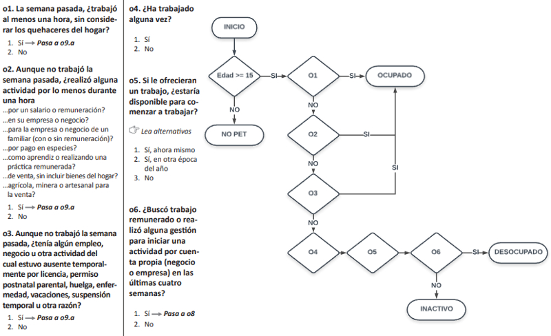

Ayudantia 1 - Introduccion a Stata
==================================

Pia Carozzi

PUC

*pjcarozzi\@uc.cl*

4.1 - Variables y etiquetas
===========================

Volvamos a revisar las variables presentes en la base de datos.

          . describe

          Contains data from data_casen_2017_1prc.dta
            obs:         2,164                          
           vars:            29                          22 Mar 2019 02:16
           size:       502,048                          
          ---------------------------------------------------------------------------------------------------------------------------------------------------------------------------------------------------------------------
                        storage   display    value
          variable name   type    format     label      variable label
          ---------------------------------------------------------------------------------------------------------------------------------------------------------------------------------------------------------------------
          folio           double  %10.0g                Identificacion hogar (comuna area seg viv hogar)
          o               double  %10.0g                Orden
          id_vivienda     double  %10.0g                Identificador de la vivienda (comuna area seg viv)
          hogar           double  %10.0g                Identificacion del hogar en la vivienda
          region          double  %49.0g     region     Region
          provincia       double  %23.0g     provincia
                                                        Provincia
          comuna          double  %10.0g     comuna     Comuna
          zona            double  %10.0g     zona       Zona
          expr            double  %10.0g                Factor de Expansion Regional
          expc            double  %10.0g                Factor de Expansion Comunal
          expr_div        double  %10.0g                Factor de expansion orientacion sexual (r23) e identidad de genero (r24)
          varstrat        double  %10.0g                Estratos de Varianza
          varunit         double  %10.0g                Conglomerados de Varianza
          sexo            double  %10.0g     sexo       Sexo
          edad            double  %10.0g                Edad
          ecivil          double  %47.0g     ecivil     Estado civil
          o1              double  %19.0g     DICO       o1. La semana pasada, trabajo al menos una hora, sin considerar los quehaceres
          o2              double  %19.0g     DICO       o2. Aunque no trabajo la semana pasada, realizo alguna actividad por lo menos d
          o3              double  %19.0g     DICO       o3. Aunque no trabajo la semana pasada, tenia algun empleo, negocio u otra acti
          o6              double  %19.0g     DICO       o6. Busco trabajo remunerado o realizo alguna gestion para iniciar una activida
          oficio1         double  %60.0g     oficio1    o9a_cod. Cual es su ocupacion u oficio? (1 digito)
          ytotcorh        double  %10.0g                Ingreso total del hogar corregido
          ypc             double  %10.0g                Ingreso total per capita del hogar corregido
          numper          double  %10.0g                Numero de personas en el hogar (excluye sdpa)
          asiste          double  %10.0g     asiste     Asiste
          esc             double  %10.0g                Escolaridad
          educ            double  %33.0g     educ       Nivel Educacional
          depen           double  %48.0g     depen      Dependencia Administrativa
          activ           double  %10.0g     activ      Condicion de actividad
          ---------------------------------------------------------------------------------------------------------------------------------------------------------------------------------------------------------------------
          Sorted by: esc

Stata tiene distintas formas de identificar una variable:

-   *Variable name*. El nombre de la variable, que por conveniencia suele mantenerse corto para facilitar su uso mediante comandos.

-   *Variable label*. La etiqueta de la variable, lo que describe a la variable. Si una variable tiene etiqueta, este sera el nombre que aparece en las tablas y graficos, entre otros.

-   *Value label*. El nombre de la etiqueta de valores que contiene los nombres de los atributos de la variable. Las variables continuas no suelen estar asociadas a una etiqueta de valores, pero estos son utiles para identificar los atributos de las variables categoricas.

[codebook](https://www.stata.com/manuals13/dcodebook.pdf#dcodebook) y [labelbook](https://www.stata.com/manuals13/dlabelbook.pdf#dlabelbook) nos permiten conocer estos identificadores.

[codebook](https://www.stata.com/manuals13/dcodebook.pdf#dcodebook) examina los nombres y etiquetas de las variables. Si no especificamos ninguna variable junto el comando, [codebook](https://www.stata.com/manuals13/dcodebook.pdf#dcodebook) nos muestra informacion para todas las variables en la base de datos. Tambien podemos ejecutar el comando seguido de una variable o lista de variables.

Exploremos la ocupacion u oficio de los casos en la muestra.

          . codebook oficio1

          ---------------------------------------------------------------------------------------------------------------------------------------------------------------------------------------------------------------------
          oficio1                                                                                                                                                            o9a_cod. Cual es su ocupacion u oficio? (1 digito)
          ---------------------------------------------------------------------------------------------------------------------------------------------------------------------------------------------------------------------

                            type:  numeric (double)
                           label:  oficio1

                           range:  [0,999]                      units:  1
                   unique values:  11                       missing .:  1,206/2,164

                        examples:  5     Trabajadores de los servicios y vendedores de comerci
                                   9     Trabajadores no calificado
                                   .     
                                   .     

Podemos observar que la variable oficio1 es una variable categorica, con un rango de atributos que va del 0 al 999. Cuando las variables poseen muchos atributos (etiquetados), [codebook](https://www.stata.com/manuals13/dcodebook.pdf#dcodebook) no muestra sino parte de ellos, como en este caso.

Si queremos ver todos los atributos etiquetados asociados a las variable, usamos el comando [labelbook](https://www.stata.com/manuals13/dlabelbook.pdf#dlabelbook).

[labelbook](https://www.stata.com/manuals13/dlabelbook.pdf#dlabelbook), a diferencia de [codebook](https://www.stata.com/manuals13/dcodebook.pdf#dcodebook), no se refiere a las variables en si, sino a las etiquetas de variables, que son registradas en Stata como informacion independiente. Varias variables pueden compartir una etiqueta de variables.

Debido a esto, necesitamos identificar previamente el nombre de la etiqueta de variables que esta asociada a la variable de interes. El output de [codebook](https://www.stata.com/manuals13/dcodebook.pdf#dcodebook) nos muestra esta informacion. En este caso, la etiqueta de variable de *oficio1* tambien se llama *oficio1*.

Si ejecutamos [labelbook](https://www.stata.com/manuals13/dlabelbook.pdf#dlabelbook) sin especificaciones, se desplegara el libro de etiquetas completo. Nuevamente, si ejecutamos [labelbook](https://www.stata.com/manuals13/dlabelbook.pdf#dlabelbook) seguido por una etiqueta de variable o una lista de etiquetas de variables, nos mostrara los atributos etiquetados solo para estas etiquetas.

          . labelbook oficio1

          ---------------------------------------------------------------------------------------------------------------------------------------------------------------------------------------------------------------------
          value label oficio1
          ---------------------------------------------------------------------------------------------------------------------------------------------------------------------------------------------------------------------

                values                                    labels
                 range:  [0,999]                   string length:  [8,60]
                     N:  11                unique at full length:  yes
                  gaps:  yes                 unique at length 12:  no
            missing .*:  0                           null string:  no
                                         leading/trailing blanks:  no
                                              numeric -> numeric:  no
            definition
                     0   Fuerzas Armada
                     1   Miembros del poder ejecutivo y de los cuerpos legislativo
                     2   Profesionales, cientificos e intelectuale
                     3   Tecnicos profesionales de nivel medi
                     4   Empleados de oficina
                     5   Trabajadores de los servicios y vendedores de comerci
                     6   Agricultores y trabajadores calificados agropecuarios y pesq
                     7   Oficiales, operarios y artesanos de artes mecanicas y de otr
                     8   Operadores de instalaciones y maquinas y montadore
                     9   Trabajadores no calificado
                   999   Sin dato

             variables:  oficio1

Podemos ver que, si bien el rango de valores de *oficio1* va de 0 a 999, no todos los valores estan etiquetados. El valor 999 corresponde a "Sin dato". En este caso, la etiqueta de valores *oficio1* solo es usada por la variable *oficio1*.

Revisemos otra etiqueta de valores:

          . labelbook DICO

          ---------------------------------------------------------------------------------------------------------------------------------------------------------------------------------------------------------------------
          value label DICO
          ---------------------------------------------------------------------------------------------------------------------------------------------------------------------------------------------------------------------

                values                                    labels
                 range:  [1,9]                     string length:  [2,19]
                     N:  3                 unique at full length:  yes
                  gaps:  yes                 unique at length 12:  yes
            missing .*:  0                           null string:  no
                                         leading/trailing blanks:  no
                                              numeric -> numeric:  no
            definition
                     1   Si
                     2   No
                     9   No sabe/no responde

             variables:  o1 o2 o3 o6

La etiqueta de valores *DICO*, definida como 1 "si", 2 "no", 9 "no sabe/no responde", es compartida por las variables *o1*, *o2*, *o3* y *o6*.

4.2 - Recodificaciones
======================

Identificar previamente el nivel de medicion y los atributos de las variables es necesario a la hora de recodificar variables, o crear variables a partir de las existentes.

Dos comandos basicos que permiten recodificar datos son [generate](https://www.stata.com/manuals13/dgenerate.pdf#dgenerate) y [replace](https://www.stata.com/manuals13/dgenerate.pdf#dgenerate).

[generate](https://www.stata.com/manuals13/dgenerate.pdf#dgenerate), abreviado gen o g, nos permite crear una nueva variable especificando su nombre y una expresion que determinara su contenido.

Creemos una variable llamada *varnueva* en la cual todas las observaciones compartan el valor 1.

          . gen varnueva=1

          . list varnueva in 1/5

               +----------+
               | varnueva |
               |----------|
            1. |        1 |
            2. |        1 |
            3. |        1 |
            4. |        1 |
            5. |        1 |
               +----------+

[replace](https://www.stata.com/manuals13/dgenerate.pdf#dgenerate) cambia el contenido de una variable existente.

Reemplacemos el contenido de *varnueva* indicando que todas las observaciones tengan el valor 7

          . replace varnueva=7
          (2,164 real changes made)

          . list varnueva in 1/5

               +----------+
               | varnueva |
               |----------|
            1. |        7 |
            2. |        7 |
            3. |        7 |
            4. |        7 |
            5. |        7 |
               +----------+

Eliminemos *varnueva*

          . drop varnueva

Los qualifiers y operadores que ya revisamos nos permitiran recodificar variables. Usemos operadores aritmeticos para calcular el ingreso total per capita para cada observacion de la muestra, creando una variable que se llamara *ypcapita*.

Utilizaremos dos variables existentes: *ytotcorh*, el ingreso total del hogar, y *numper*, el numero de personas en el hogar.

          . gen ypcapita=ytotcorh/numper
          (2 missing values generated)

Revisemos los estadisticos descriptivos para el ingreso total per capita.

          . summarize ypcapita

              Variable |        Obs        Mean    Std. Dev.       Min        Max
          -------------+---------------------------------------------------------
              ypcapita |      2,162    357332.5    625617.8          0   2.24e+07

La media de ingreso per capita es \$357333. La variable *ypc*, generada por Casen, contiene la misma informacion.

          . list ypcapita ypc in f/10

               +-------------------+
               | ypcapita      ypc |
               |-------------------|
            1. | 283104.3   283104 |
            2. |  84599.6    84600 |
            3. | 114894.5   114895 |
            4. | 258045.5   258046 |
            5. | 81912.34    81912 |
               |-------------------|
            6. | 208187.9   208188 |
            7. | 188515.7   188516 |
            8. |   243489   243489 |
            9. |   234932   234932 |
           10. | 146078.1   146078 |
               +-------------------+

Supongamos que nos encargan calcular el porcentaje de personas en edad de trabajar. Sabemos que, por definicion de Casen, son personas en edad de trabajar todos quienes tienen 15 años o mas.

Construyamos una variable dicotomica que identifique con 1 a quienes tienen 15 años o mas, y con 0 a quienes tienen menos de 15 años.

Primero, verifiquemos si la variable *edad* tiene valores perdidos o si existe un valor que identifique que la edad no ha sido registrada (ej. NS/NR, 999).

La variable no tiene casos perdidos. Tampoco se ha codificado un valor tal que nos sugiera dejar fuera algunos casos para los que no existe el dato.

Usamos la variable *edad*, tal y como es codificada en Casen, y el qualifier [if](https://www.stata.com/manuals13/u11.pdf#u11.1.3ifexp) para crear una nueva variable llamada *pet*.

          . gen pet=0

          . replace pet=1 if edad>=15
          (1,760 real changes made)

[recode](https://www.stata.com/manuals13/drecode.pdf) es oro comando que podemos usar para cumplir con esta tarea. [recode](https://www.stata.com/manuals13/drecode.pdf) cambia los valores numericos de una variable de acuerdo con reglas especificas.

Esta vez usaremos rangos de edad:

          . gen pet2=edad

          . recode pet2 (0/14=0) (15/95=1)
          (pet2: 2143 changes made)

Ambas maneras nos entregan los mismos resultados. Corroboremos si la cantidad de personas en edad de trabajar es igual bajo ambas recodificaciones. Utilizamos el comando [tabulate](http://www.stata.com/manuals13/rtabulateoneway.pdf#rtabulateoneway), abreviado [tab](http://www.stata.com/manuals13/rtabulateoneway.pdf#rtabulateoneway), para obtener tablas de frecuencias y porcentajes. Podemos escribir, en dos pasos:

          . tab pet

                  pet |      Freq.     Percent        Cum.
          ------------+-----------------------------------
                    0 |        404       18.67       18.67
                    1 |      1,760       81.33      100.00
          ------------+-----------------------------------
                Total |      2,164      100.00

          . tab pet2

                 pet2 |      Freq.     Percent        Cum.
          ------------+-----------------------------------
                    0 |        404       18.67       18.67
                    1 |      1,760       81.33      100.00
          ------------+-----------------------------------
                Total |      2,164      100.00

O en sólo uno:

          . tab1 pet pet2

          -> tabulation of pet  

                  pet |      Freq.     Percent        Cum.
          ------------+-----------------------------------
                    0 |        404       18.67       18.67
                    1 |      1,760       81.33      100.00
          ------------+-----------------------------------
                Total |      2,164      100.00

          -> tabulation of pet2  

                 pet2 |      Freq.     Percent        Cum.
          ------------+-----------------------------------
                    0 |        404       18.67       18.67
                    1 |      1,760       81.33      100.00
          ------------+-----------------------------------
                Total |      2,164      100.00

Ambas tablas muestran que tenemos 1760 personas en edad de trabajar, lo que equivale a un 81.33% de nuestra muestra.

Supongamos ahora que nos encargan identificar la condicion de actividad de los encuestados, con el fin de calcular las tasas de ocupacion, desocupacion e inactividad.

Primero necesitamos identificar las variables que nos sirven para construir la variable que identifique en la muestra a quienes estan ocupados, desocupados e inactivos. La siguiente figura muestra un fragmento del Modulo Trabajo del [Cuestionario Casen 2017](http://observatorio.ministeriodesarrollosocial.gob.cl/casen-multidimensional/casen/docs/Cuestionario_Casen2017.pdf "Cuestionario Casen 2017") y sintetiza la logica que seguiremos en nuestra recodificacion.

Generamos tablas de frecuencia para las variables que necesitamos usando [tab1](http://www.stata.com/manuals13/rtabulateoneway.pdf#rtabulateoneway) con la opcion missing (abreviada m). La opcion missing nos permite tratar los datos perdidos como si fueran una categoría adicional y saber cual es su porcentaje en la muestra.

          . tab1 o1 o2 o3 o6, m

          -> tabulation of o1  

                o1. La semana |
           pasada, trabajo al |
          menos una hora, sin |
               considerar los |
                   quehaceres |      Freq.     Percent        Cum.
          --------------------+-----------------------------------
                           Si |        920       42.51       42.51
                           No |        840       38.82       81.33
                            . |        404       18.67      100.00
          --------------------+-----------------------------------
                        Total |      2,164      100.00

          -> tabulation of o2  

                o2. Aunque no |
            trabajo la semana |
              pasada, realizo |
             alguna actividad |
               por lo menos d |      Freq.     Percent        Cum.
          --------------------+-----------------------------------
                           Si |         13        0.60        0.60
                           No |        827       38.22       38.82
                            . |      1,324       61.18      100.00
          --------------------+-----------------------------------
                        Total |      2,164      100.00

          -> tabulation of o3  

                o3. Aunque no |
            trabajo la semana |
          pasada, tenia algun |
            empleo, negocio u |
                    otra acti |      Freq.     Percent        Cum.
          --------------------+-----------------------------------
                           Si |         25        1.16        1.16
                           No |        802       37.06       38.22
                            . |      1,337       61.78      100.00
          --------------------+-----------------------------------
                        Total |      2,164      100.00

          -> tabulation of o6  

            o6. Busco trabajo |
                 remunerado o |
               realizo alguna |
                 gestion para |
                  iniciar una |
                     activida |      Freq.     Percent        Cum.
          --------------------+-----------------------------------
                           Si |         89        4.11        4.11
                           No |        713       32.95       37.06
                            . |      1,362       62.94      100.00
          --------------------+-----------------------------------
                        Total |      2,164      100.00

En *o1* tenemos 404 casos perdidos. Esto se explica porque las preguntas de *o1* a *o8* solo son contestadas por quienes tienen 15 años o mas. Podemos comprobarlo al ejecutar:

          . tab o1 if edad<15, m

                o1. La semana |
           pasada, trabajo al |
          menos una hora, sin |
               considerar los |
                   quehaceres |      Freq.     Percent        Cum.
          --------------------+-----------------------------------
                            . |        404      100.00      100.00
          --------------------+-----------------------------------
                        Total |        404      100.00

A las variables *o2*, *o3* y *o6* se le suman como casos perdidos quienes han respondido "si" en las preguntas anteriores.

          . dis 404+920
          1324

          . dis 1324+13
          1337

          . dis 1337+25
          1362

Creamos una variable nueva, llamada *act*, que sea condicional a los valores de *o1*, *o2*, *o3* y *o6*, usando el qualifier [if](https://www.stata.com/manuals13/u11.pdf#u11.1.3ifexp).

*act* es igual a 1 si el o la encuestada contesto *o1* u *o2* u *o3* con "si", por lo tanto, se encuentra ocupado/a.

          . gen act=1 if o1==1 | o2==1 | o3==1
          (1,206 missing values generated)

Esto genera 1206 casos pedidos para los que la expresion logica no se cumple. Reemplazamos parte de esos casos perdidos con "2" si el o la encuestada responde "si" en la pregunta *o6*, por lo tanto, se encuentra desocupado.

          . replace act=2 if o6==1
          (89 real changes made)

Son reemplazados 82 casos para los cuales si se cumplia *o6==1*. Finalmente, nos queda definir a quienes respondieron "no" en *o6*. Alternativamente, podemos usar el operador *!=* y condicionar el remplazo a quienes no respondieron "si" en las preguntas anteriores, dejando como perdidos a quienes no son poblacion en edad de trabajar (el resultado es el mismo)

          . replace act=3 if o1!=1 & o2!=1 & o3!=1 & o6!=1
          (1,117 real changes made)

          . replace act=. if pet==0
          (404 real changes made, 404 to missing)

Comparamos la variable recien creada tabulando *act* y *activ*, variable creada por Casen que contiene la misma informacion.

          . tab1 act activ, m

          -> tabulation of act  

                  act |      Freq.     Percent        Cum.
          ------------+-----------------------------------
                    1 |        958       44.27       44.27
                    2 |         89        4.11       48.38
                    3 |        713       32.95       81.33
                    . |        404       18.67      100.00
          ------------+-----------------------------------
                Total |      2,164      100.00

          -> tabulation of activ  

            Condicion |
                   de |
            actividad |      Freq.     Percent        Cum.
          ------------+-----------------------------------
             Ocupados |        958       44.27       44.27
          Desocupados |         89        4.11       48.38
            Inactivos |        713       32.95       81.33
                    . |        404       18.67      100.00
          ------------+-----------------------------------
                Total |      2,164      100.00

O como tabla cruzada

          . tab act activ, m

                     |           Condicion de actividad
                 act |  Ocupados  Desocupad  Inactivos          . |     Total
          -----------+--------------------------------------------+----------
                   1 |       958          0          0          0 |       958
                   2 |         0         89          0          0 |        89
                   3 |         0          0        713          0 |       713
                   . |         0          0          0        404 |       404
          -----------+--------------------------------------------+----------
               Total |       958         89        713        404 |     2,164

Nos falta identificar la variable *act* y sus atributos. Primero creamos una etiqueta de variable que la describa

          . label variable act "Actividad"

Si queremos usar otra etiqueta, simplemente sobreescribimos.

          . label variable act "Actividad recodificada"

Ahora etiquetemos los atributos. Primero debemos definir una etiqueta de valores y parear cada valor con el atributo que queremos que muestre.

          . label define valactividad 1 "Ocupado" 2 "Desempleado" 3 "Inactivo"

Si queremos cambiar algun valor o etiqueta de valor, usamos la opcion *replace*

          . label define valactividad 1 "Ocupado" 2 "Desocupado" 3 "Inactivo", replace

Si queremos agregar un valor y su etiqueta, usamos la opcion *add*

          . label define valactividad 9 "No PET", add

El segundo paso es enlazar la variable a la etiqueta de valores creada.

          . label values act valactividad

Tabulemos la variable *act*

          . tab act, m

            Actividad |
          recodificad |
                    a |      Freq.     Percent        Cum.
          ------------+-----------------------------------
              Ocupado |        958       44.27       44.27
           Desocupado |         89        4.11       48.38
             Inactivo |        713       32.95       81.33
                    . |        404       18.67      100.00
          ------------+-----------------------------------
                Total |      2,164      100.00

Las etiquetas de valores no modifican los valores de las variables. En este caso, definimos una etiqueta para el valor "9" como "No PET", pero este no existe en la variable, por lo que simplemente no los muestra.

Recodifiquemos a quienes no son poblacion en edad de trabajar como "9"

          . replace act=9 if pet==0
          (404 real changes made)

Veamos ahora la tabla de frecuencias de *act*

          . tab act, m

            Actividad |
          recodificad |
                    a |      Freq.     Percent        Cum.
          ------------+-----------------------------------
              Ocupado |        958       44.27       44.27
           Desocupado |         89        4.11       48.38
             Inactivo |        713       32.95       81.33
               No PET |        404       18.67      100.00
          ------------+-----------------------------------
                Total |      2,164      100.00

4.2 - Cerrar sesion
===================

Finalicemos la sesion de hoy. para guardar la base de datos modificada, usamos:

          . save data_casen_ayud1, replace
          file data_casen_ayud1.dta saved

Si estamos usando un *log file*, lo cerramos usando su nombre:

          . quietly log close ayudantia
